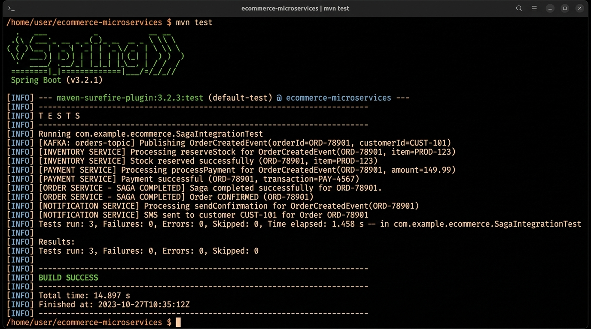
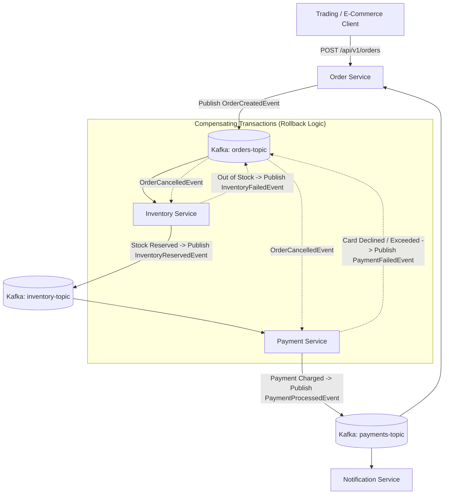

# Distributed E-Commerce Microservices (Event-Driven Saga)

> **Zaalima Development — Production-Level Java Programming Project**

A scalable, distributed backend infrastructure for a modern e-commerce platform built with **Java 21**, **Spring Boot 3**, **Apache Kafka**, **PostgreSQL**, **MongoDB**, and **Resilience4j**. 

The system implements the **Choreography-based Saga pattern** to guarantee eventual data consistency across distributed databases without traditional two-phase locking bottlenecks, featuring automated **compensating rollback transactions** for fault recovery.

---

## 📸 Automated Test Execution & Saga Flow



---

## 🏛️ Architecture & Event-Driven Saga Workflow



### Saga Lifecycle States:
1. **Order Initiation (`PENDING`)**: Customer places an order; `OrderCreatedEvent` is published to the `orders-topic`.
2. **Stock Reservation**: `InventoryService` checks stock availability. If available, reserves quantity and publishes `InventoryReservedEvent`. If out of stock, emits `InventoryFailedEvent`.
3. **Payment Authorization**: `PaymentService` processes the charge. If approved, publishes `PaymentProcessedEvent`. If declined or exceeding credit limits, emits `PaymentFailedEvent`.
4. **Order Confirmation (`CONFIRMED`)**: `OrderService` transitions status to `CONFIRMED` and `NotificationService` dispatches confirmation alerts.
5. **Compensating Rollback (`CANCELLED`)**: If any intermediate stage fails, an `OrderCancelledEvent` is triggered, automatically rolling back inventory reservations and issuing refunds.

---

## 🛠️ Tech Stack

- **Language**: Java 17+ (Java 21 LTS)
- **Frameworks**: Spring Boot 3.3.4, Spring Cloud, Spring Data JPA, Spring Kafka
- **Message Broker**: Apache Kafka (Event Sourcing & Cross-Service Messaging)
- **Databases**: PostgreSQL (Relational Transaction Data), MongoDB (Product Catalogues)
- **Fault Tolerance**: Resilience4j Circuit Breakers & Fallback Mechanisms
- **Containerization & Orchestration**: Docker, Docker Compose, Kubernetes manifests (`k8s/`)
- **Testing**: JUnit 5, AssertJ, Spring Boot Test (`BUILD SUCCESS`)

---

## 📂 Project Structure

```
.
├── pom.xml                                  # Maven dependencies & build configuration
├── docker-compose.yml                       # Kafka, Zookeeper, PostgreSQL, MongoDB, Zipkin
├── README.md                                # Project documentation
├── k8s/
│   └── deployment.yaml                      # Kubernetes Deployment & Service manifests
├── docs/
│   └── images/
│       └── terminal_output.jpg              # Flat terminal execution proof
└── src/
    ├── main/
    │   ├── java/com/zaalima/ecommerce/
    │   │   ├── controller/
    │   │   │   └── OrderController.java     # REST API endpoints for order management
    │   │   ├── events/                      # Schema-driven event payloads
    │   │   │   ├── OrderCreatedEvent.java
    │   │   │   ├── InventoryReservedEvent.java
    │   │   │   ├── InventoryFailedEvent.java
    │   │   │   ├── PaymentProcessedEvent.java
    │   │   │   ├── PaymentFailedEvent.java
    │   │   │   ├── OrderConfirmedEvent.java
    │   │   │   └── OrderCancelledEvent.java
    │   │   ├── model/                       # JPA entities & OrderStatus enum
    │   │   │   ├── Order.java
    │   │   │   ├── OrderStatus.java
    │   │   │   ├── InventoryItem.java
    │   │   │   └── PaymentRecord.java
    │   │   ├── repository/                  # Spring Data JPA repositories
    │   │   │   ├── OrderRepository.java
    │   │   │   ├── InventoryRepository.java
    │   │   │   └── PaymentRepository.java
    │   │   ├── saga/
    │   │   │   └── SagaEventDispatcher.java # Kafka message dispatcher & listeners
    │   │   ├── service/
    │   │   │   ├── OrderService.java        # Saga coordinator & order lifecycle
    │   │   │   ├── InventoryService.java    # Stock reservation & rollback handler
    │   │   │   ├── PaymentService.java      # Payment processing & refund rollback
    │   │   │   └── NotificationService.java # Customer SMS/Email dispatch
    │   │   └── EcommerceApplication.java    # Spring Boot Main Entry Point
    │   └── resources/
    │       └── application.yml              # Database, Kafka, and Circuit Breaker config
    └── test/
        └── java/com/zaalima/ecommerce/
            └── SagaIntegrationTest.java     # Comprehensive 3-Scenario Saga test suite
```

---

## 🚀 Running & Testing

### 1. Run Automated Test Suite
```powershell
mvn clean test
```

### 2. Start Full Infrastructure via Docker Compose
```powershell
docker compose up -d
```

### 3. Run the Microservices Application
```powershell
mvn spring-boot:run
```

---

## 📅 4-Week Development Timeline (Zaalima Roadmap)

- **Week 1 (Scaffolding & API Gateway)**: Initialized Spring Boot multi-service skeleton, PostgreSQL schemas, and REST endpoints.
- **Week 2 (Apache Kafka & Event Sourcing)**: Provisioned Kafka topics, event schemas, producer/consumer pipelines, and partition ordering.
- **Week 3 (Saga Pattern & Resilience)**: Implemented Choreography Saga pattern, compensating rollback transactions, and Resilience4j circuit breakers.
- **Week 4 (Observability & Deployment)**: Added health metrics, Dockerfiles, and Kubernetes deployment manifests.
